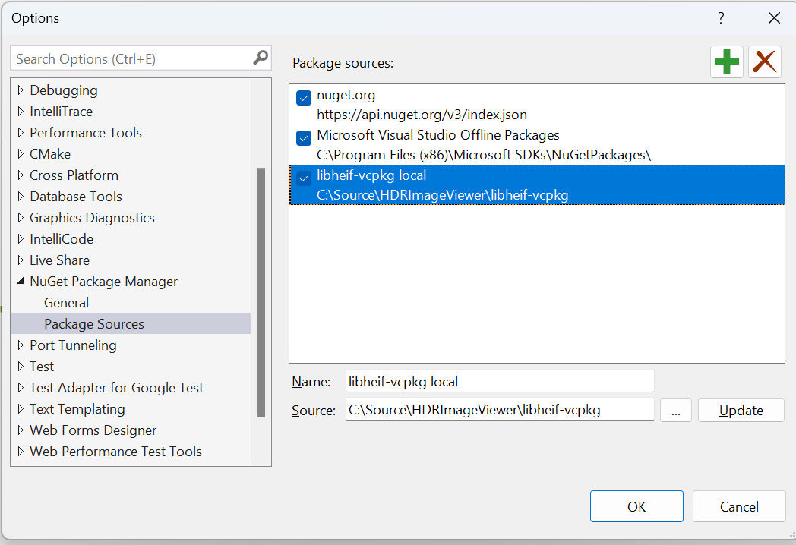

 

<h1 align="center">HDR + WCG Image Viewer</h3>

  

  

    Windows 10/11 app for viewing high dynamic range (HDR) and wide color gamut (WCG) images at full quality on a capable HDR10 or WCG display.
     
     
    <a href="https://www.microsoft.com/store/apps/9PGN3NWPBWL9">Get app from the Microsoft Store</a>
    ·
    <a href="https://13thsymphony.github.io/hdrimageviewer/">App support page</a>
     
    <strong>NOTE:</strong> Currently the Store version lags significantly behind this repo.
  

 

## About the Project
This is a Universal Windows Platform (UWP) app that uses [DirectX Advanced Color](https://aka.ms/directxhdr) to decode and render HDR image formats at the best available quality on a supported HDR10 display.

Supported formats include:
* OpenEXR
* Radiance RGBE (.hdr)
* JPEG XR (including Xbox and Windows variants)
* HEIC with HDR10/BT.2100 data 
* AVIF with HDR10/BT.2100 data
* **EXPERIMENTAL:** Apple HDR GainMap images using HEIC and JPEG
* JPEG, PNG and other SDR formats with wide gamut and/or color profile information

The app performs luminance display mapping/tone mapping to adapt an HDR image to the capability of the display. It also includes some useful tools for HDR developers such as rendering the image luminance as a colorized heatmap, or forcing an image to be interpreted with a specific colorspace (for example, PNG images encoded as HDR10).

## Running the app

The minimum requirements to run the app are a recent version of Windows 10 or 11 (19H1 or greater) and a GPU that supports DirectX 11. You should also update your graphics (WDDM) driver.

### Display hardware

If you use an SDR display the app will use tone mapping to render any HDR images to the best of its ability. You will obviously need a Windows-compatible HDR display to experience a benefit from HDR images.

HDR displays vary greatly in quality - low quality models offer no real benefit over SDR and in fact often screw up color and graphics rendering as to make it look *worse* than SDR. For best results a certified display is ***strongly*** recommended, including:

* [VESA DisplayHDR 500 or above](https://displayhdr.org/certified-products/)
* [AMD FreeSync Premium Pro](https://www.amd.com/en/technologies/freesync-hdr-games)
* [NVIDIA G-SYNC and G-SYNC Ultimate](https://www.nvidia.com/en-us/geforce/products/g-sync-monitors)

### Command line usage
You should invoke HDRImageViewer from the directory containing the image you wish to load - UWP apps launched from a command line only have access to files within the working directory.

#### Parameters
`-f` Start in fullscreen mode

`-h` Start with UI hidden

`-forcebt2100` Force images to use BT.2100 PQ

`-input:filename` Load `filename`

**Note: Filename must be relative to the current working directory as HDRImageViewer only has access to that directory.**

#### Example
`HDRImageViewer.exe -f -h -input:myimage.jxr`

## Compiling the app

You'll need [Visual Studio 2022](www.visualstudio.com) with the following workloads installed:
* `Desktop Development with C++`
* `Universal Windows Platform Development`
  * In *Optional Components*, make sure `C++ (v143) Universal Windows Platform tools` is checked.

(VS2019 probably works, too, but this is untested)

### Manually including the libheif package

The repo contains a copy of [libheif](https://github.com/strukturag/libheif) built using [vcpkg](https://github.com/Microsoft/vcpkg/) and exported into a local NuGet package at `\libheif-vcpkg\vcpkg-export-20210528-221932.1.0.0.nupkg`. Libheif is consumed by HDRImageViewer as a dynamic link library to comply with requirements of the LGPL license.

You must manually add the `libheif-vcpkg` directory to Visual Studio's list of NuGet package repositories:

1. In Visual Studio, go to `Tools > NuGet Package Manager > Package Manager Settings`.
2. In the `Package Sources` page, add the `libheif-vcpkg` directory as a new source.

Visual Studio should show something similar to:

## Acknowledgments

This app includes source, object code, and/or techniques from many excellent sources, including but not limited the following:

* [D2DAdvancedColorImages SDK sample](https://docs.microsoft.com/en-us/samples/microsoft/windows-universal-samples/d2dadvancedcolorimages/).
* Rick Manning's [HDR Image Viewer](https://www.microsoft.com/store/productId/9NPSWXVL7W40).
* [DirectXTex](https://github.com/Microsoft/DirectXTex).
* [OpenEXR](https://www.openexr.com/).
* [zlib](https://www.zlib.net/).
* [libheif](https://github.com/strukturag/libheif).

3rd party licenses can be found in the `3rdparty` directory.